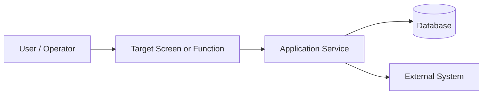
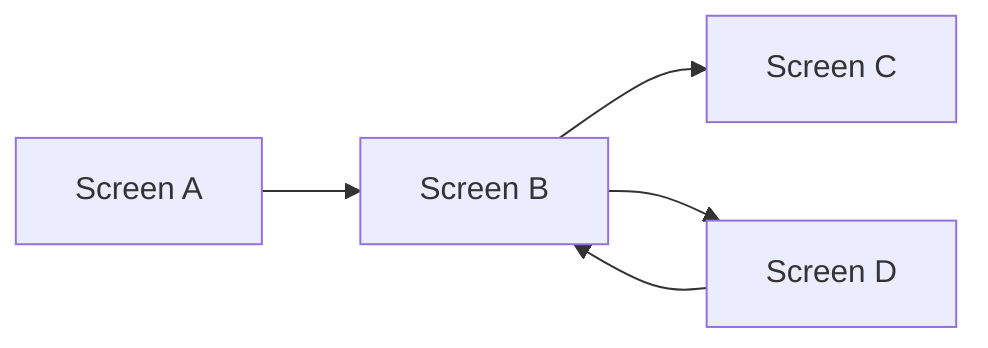
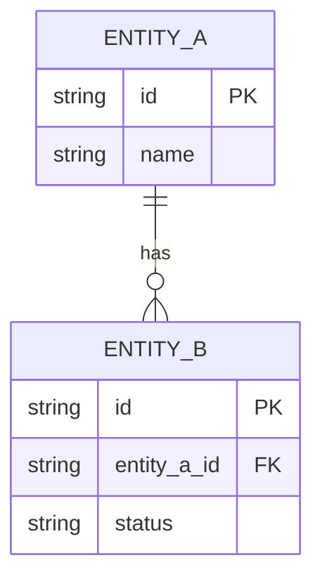

# [PROJECT_NAME] - Basic Design Document

## [FEATURE_NAME]

| | |
|---|---|
| **Project Code:** | [PROJECT_CODE] |
| **Document Code:** | [DOCUMENT_CODE] |
| **Version:** | [VERSION] |
| **Effective Date:** | [DATE] |

---

## Record of change

| No | Effective Date | Version | Change Description | Reason | Reviewer | Approver |
|---|---|---|---|---|---|---|
| 1 | [dd/mm/yyyy] | [x.y] | Initial version | Feature development | | |
| 2 | | | | | | |
| 3 | | | | | | |

---

## TABLE OF CONTENTS

1. [Introduction](#1-introduction)
   - 1.1 [Purpose](#11-purpose)
   - 1.2 [Scope](#12-scope)
   - 1.3 [References](#13-references)
   - 1.4 [Overview](#14-overview)
2. [System Overview](#2-system-overview)
   - 2.1 [System Context](#21-system-context)
   - 2.2 [Component Overview](#22-component-overview)
3. [Screen Design](#3-screen-design)
   - 3.1 [Screen List](#31-screen-list)
   - 3.2 [Screen Transition Diagram](#32-screen-transition-diagram)
   - 3.3 [Screen Layout](#33-screen-layout)
   - 3.4 [Screen I/O Item List](#34-screen-io-item-list)
   - 3.5 [Screen Action Detail](#35-screen-action-detail)
   - 3.6 [Common UI Rules](#36-common-ui-rules)
4. [Data Model Design](#4-data-model-design)
   - 4.1 [ER Diagram](#41-er-diagram)
   - 4.2 [Entity List](#42-entity-list)
   - 4.3 [Entity Definition](#43-entity-definition)
   - 4.4 [CRUD Matrix](#44-crud-matrix)
5. [Optional Design Sections](#5-optional-design-sections)
   - 5.1 [External Interface Design](#51-external-interface-design)
   - 5.2 [Batch Processing Design](#52-batch-processing-design)
   - 5.3 [Reports / Forms Design](#53-reports--forms-design)
6. [Assumptions and Open Items](#6-assumptions-and-open-items)

---

## 1. Introduction

### 1.1 Purpose

This Basic Design (BD) document defines the high-level design for [FEATURE_NAME] in [PROJECT_NAME].

The document is intended for:

- Designers and developers
- Test engineers
- Reviewers and project stakeholders

### 1.2 Scope

This document covers:

- System context and major components relevant to the feature
- Mandatory screen design deliverables
- Mandatory data model design deliverables
- Optional design sections only when the feature requires them

This document does not cover implementation-level logic. Those details belong in Detailed Design.

### 1.3 References

| No. | Document Number | Title |
|---|---|---|
| 1 | [SRS-DOC-ID] | Software Requirements Specification - [PROJECT_NAME] |
| 2 | [BD-GUIDE-ID] | IPA Basic Design guidance / project template rules |
| 3 | [Add other references] | |

### 1.4 Overview

This template is intentionally concise.

- Section 3 and Section 4 are mandatory in BD
- Section 5 is optional and should be included only when applicable
- Remove unused placeholders before finalizing the document

---

## 2. System Overview

### 2.1 System Context

**Purpose:** Briefly explain where this feature sits in the overall system.

**System Context Diagram:**



**Context Notes:**

- Feature objective: [Short summary]
- Primary users: [User roles]
- Related subsystems: [Subsystems / modules]
- Related requirements: [SRS IDs]

### 2.2 Component Overview

| Component | Responsibility | Input / Output | Notes |
|---|---|---|---|
| [UI / Screen] | [What it handles] | [Main I/O] | |
| [Service / API] | [What it handles] | [Main I/O] | |
| [Data Store / Table Group] | [What it stores] | [Main I/O] | |

---

## 3. Screen Design

**Mandatory section:** Include all subsections in this chapter for screen-based features.

### 3.1 Screen List

| No | Screen ID | Screen Name | Purpose | Related Requirement / Use Case |
|---|---|---|---|---|
| 1 | SCR-001 | [Screen Name] | [Purpose] | [FR / UC] |
| 2 | SCR-002 | [Screen Name] | [Purpose] | [FR / UC] |

### 3.2 Screen Transition Diagram



**Transition Notes:**

- Entry point: [How the user reaches this screen group]
- Main transition rules: [Key navigation rules]
- Error or cancel routes: [Back / cancel behavior]

### 3.3 Screen Layout

#### Screen: [Screen Name] ([Screen ID])

**Purpose:** [What the user can do on this screen]

**Layout Sketch:**

```
+--------------------------------------------------+
| Header: [Title]                        [User]    |
+--------------------------------------------------+
| Search / Condition Area                          |
+--------------------------------------------------+
| Main Content Area                                |
| - List / Form / Detail                           |
| - Main controls                                  |
+--------------------------------------------------+
| Action Area: [Button] [Button] [Button]          |
+--------------------------------------------------+
```

**Layout Notes:**

- Main areas: [Header / filter / list / detail / footer]
- Key display rules: [Highlight, readonly, hidden, modal]
- Related requirements: [SRS IDs]

### 3.4 Screen I/O Item List

#### Screen: [Screen Name] ([Screen ID])

| No | Item ID | Item Name | I/O | Type | Required | Validation / Format | Source / Destination |
|---|---|---|---|---|---|---|---|
| 1 | item_01 | [Item Name] | Input | Text | Yes | Max 50 chars | User input |
| 2 | item_02 | [Item Name] | Output | Label | No | YYYY/MM/DD | [Table / API] |
| 3 | item_03 | [Item Name] | Input | Select | Yes | Code list | [Master / API] |

### 3.5 Screen Action Detail

#### Screen: [Screen Name] ([Screen ID])

| No | Action | Trigger | Processing Summary | Success Result | Error Result |
|---|---|---|---|---|---|
| 1 | Search | Search button click | Validate conditions and retrieve data | Result list displayed | Error message displayed |
| 2 | Register | Register button click | Validate input and save data | Completion message displayed | Input errors highlighted |
| 3 | Cancel | Cancel button click | Discard temporary changes | Return to previous state | - |

### 3.6 Common UI Rules

| No | Rule Category | Rule Description |
|---|---|---|
| 1 | Validation | Required items must be checked before execution |
| 2 | Error Display | Validation errors are shown near the related item |
| 3 | Authority | Buttons and data visibility follow the user role |
| 4 | Navigation | Cancel and back actions must return to the defined previous screen |

---

## 4. Data Model Design

**Mandatory section:** Include all subsections in this chapter when the feature creates, reads, updates, or deletes business data.

### 4.1 ER Diagram



**ER Notes:**

- Main entities: [Entity names]
- Key relationships: [1:N, N:M, reference rules]
- Scope note: [Only entities relevant to this feature]

### 4.2 Entity List

| No | Entity Name | Description | Primary Key | Related Screens / Functions |
|---|---|---|---|---|
| 1 | [Entity Name] | [Business meaning] | [PK] | [Screen / function] |
| 2 | [Entity Name] | [Business meaning] | [PK] | [Screen / function] |

### 4.3 Entity Definition

#### Entity: [Entity Name]

| No | Attribute Name | Type | Length | Null | Key | Description | Source / Rule |
|---|---|---|---|---|---|---|---|
| 1 | [attribute_1] | VARCHAR | 50 | No | PK | [Description] | [Business rule] |
| 2 | [attribute_2] | VARCHAR | 20 | Yes | FK | [Description] | [Reference entity] |
| 3 | [attribute_3] | DATETIME | - | No | - | [Description] | System generated |

**Entity Notes:**

- Uniqueness / index: [If needed]
- Lifecycle notes: [Create/update/delete policy]
- Related requirements: [SRS IDs]

### 4.4 CRUD Matrix

| Entity | Function / Screen A | Function / Screen B | Function / Screen C |
|---|---|---|---|
| [Entity A] | C, R | R, U | R |
| [Entity B] | R | C, R, U | D |

**Legend:** C = Create, R = Read, U = Update, D = Delete

---

## 5. Optional Design Sections

Include the following sections only when applicable. Remove unused sections from the final BD.

### 5.1 External Interface Design

| Interface ID | Interface Name | Direction | External System | Summary |
|---|---|---|---|---|
| IF-001 | [Name] | Input / Output | [System name] | [Short purpose] |

Add request / response examples or item definitions only when the interface is in scope for this feature.

### 5.2 Batch Processing Design

| Job ID | Job Name | Trigger / Schedule | Summary | Input / Output |
|---|---|---|---|---|
| JOB-001 | [Name] | [Schedule] | [Short purpose] | [Main I/O] |

Add detailed flow only when the feature contains batch processing.

### 5.3 Reports / Forms Design

| Report ID | Report / Form Name | Trigger | Output Format | Summary |
|---|---|---|---|---|
| RPT-001 | [Name] | [Manual / schedule] | PDF / Excel / CSV | [Short purpose] |

Add layout or item detail only when the feature produces reports or forms.

---

## 6. Assumptions and Open Items

### Assumptions

- [Assumption 1]
- [Assumption 2]

### Open Items

| No | Topic | Description | Owner | Due Date |
|---|---|---|---|---|
| 1 | [Topic] | [Open point to confirm] | [Owner] | [Date] |

---

**End of Basic Design Document**